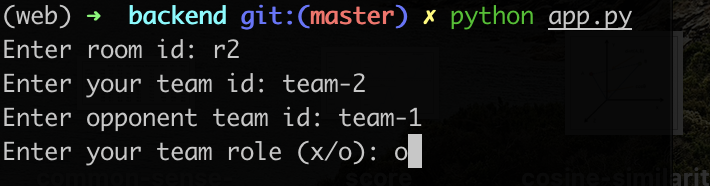

# Hướng dẫn chạy

1. Chạy trọng tài
2. Lấy link trọng tài để chạy Backend và Frontend
3. Chạy Frontend
4. Chạy AI
5. Chạy Backend
6. Cách chạy cụ thể được hướng dẫn trong file README của referee, backend và frontend

## Cách chạy AI

1. Vào thư mục /AI
2. Chạy `build/ai_linux_amd64` hoặc `build/ai_windows_amd64.exe` hoặc `go run main.go` (cần cài đặt Go)

## Cách chạy Backend

1. Vào thư mục /backend
2. Cài đặt môi trường `pip install -r requirements.txt`
3. Chạy `python app.py`
4. Điền thông tin phòng và 2 đội chơi
   
   
